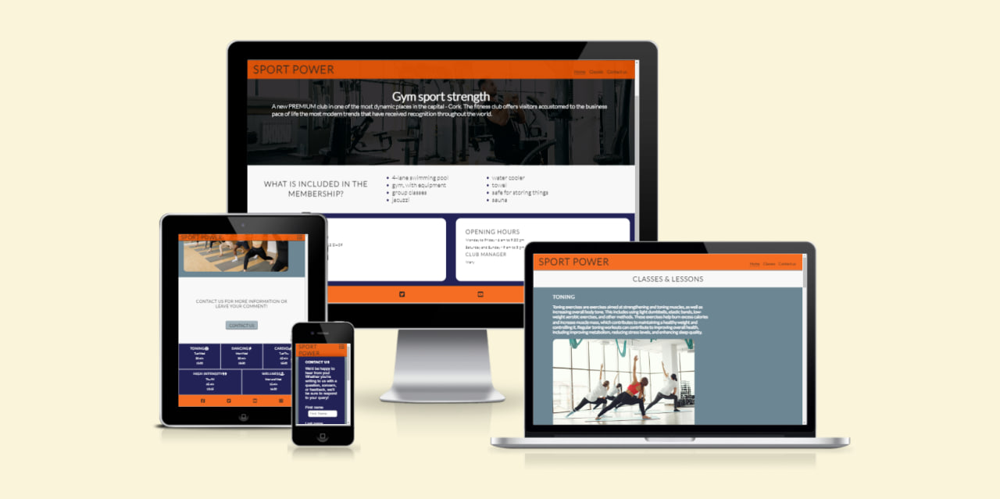
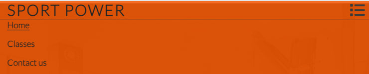
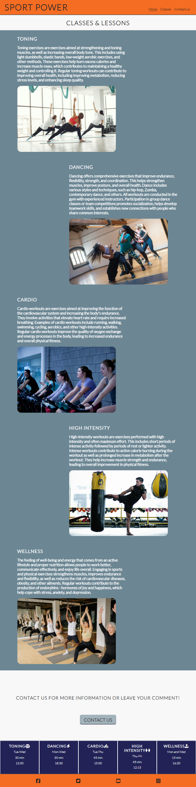
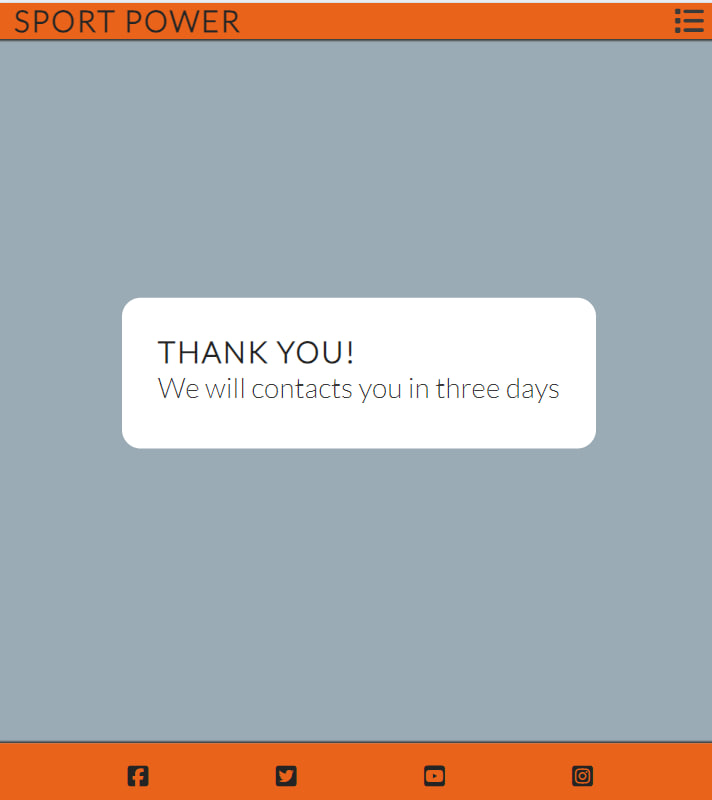

# Sport-Power

Sport Power is a website created for those who strive for top results in their training programs. We aim to inspire and motivate people on the path to a healthy lifestyle by providing personalized approaches for strength training, cardio, and dance, as well as offering a wide range of group classes led by experienced instructors.

## Features
+ ### Navigation Bar
  - At the top of the page, in the navigation bar in the left corner, the gym logo is displayed. On the right side, there are navigation links:
     * "Home" - leads to the homepage, where users can learn about the gym.
     * "Classes" - leads to the page of classes and activities offered by the gym with a trainer.
     * "Contact Us" - leads to the contact form page, where users can fill out a form to get in touch with the company or leave feedback. 
   - Links have an animated effect when hovered.
   - navigation simply explains to the user the name of the gym and classes, making the information easy to find.
   - Styling the navigation bar for different devices:
     * On computers and laptops: on the left side is the gym logo, and on the right are navigation links.

      
     * On mobile devices: the name of the gym is on the left side and the hamburger menu is on the right.

      
     * When you click on the hamburger menu, three pages are shown.

    

+ ### Home Page
  - Represent:
    * The header displays the name of the gym with its location and a short motivational advertisement for people who want to improve their health and appearance.
    * The main content contains items that include membership in the gym.
    * There are blocks at the bottom of the page with the location and contacts and the opening hours of the gym.
    * The footer contains social media links that open in a new tab.
  
   
+ ### Classes & Lessons Page
  - On the main page, there is brief information about all the lessons that the gym offers with pictures of these activities under the text.
  - Below the lesson and class information is a call to action section with a message and a button leading to a contact form. The submit button animates on hover.
  - At the bottom of the main page there is a schedule for each day of different lessons, with information on the duration, start time and days of all classes.
  - It has a footer identical to the home page's footer.

   

+ ### Contact Us Page
  - The contact page has a contact form.
  - All input data is required.
  - The page is responsive for all screen sizes.
  - The submit button takes you to the reply page.

  

+ ### Response page
  - A response page will appear immediately after submitting the form, containing a thank you message and a promise to contact the client in three days

  
  
## Technologies Used
- HTML - used as the main basis of the site
- CSS added styling to elements
- VSCode - used as an editor for writing
- CSS Grid - used for contacts to place information
- CSS Flexbox - used for alignment and symmetry of element placement
- Git - used for site version control.
- GitHub - used to save site code

## Design
### Color Combination
  - Orange was chosen for the navigation bar and footer, which contains social media links. This color stimulates desire and gives motivation to a person to take action.
  - The dark blue color was used to highlight the work graph and schedule, as well as the contact form. Color highlights key information on the site.
  - Light gray with a blue tint was chosen as the main color for the main content on the "Lessons & Classes" page, as well as the background for the "Contact Us" and reply page.
  - White color was used for contrast and basic information.

## Testing

Please refer to the [Testing.md](Testing.md) file for all test-related documentation.

