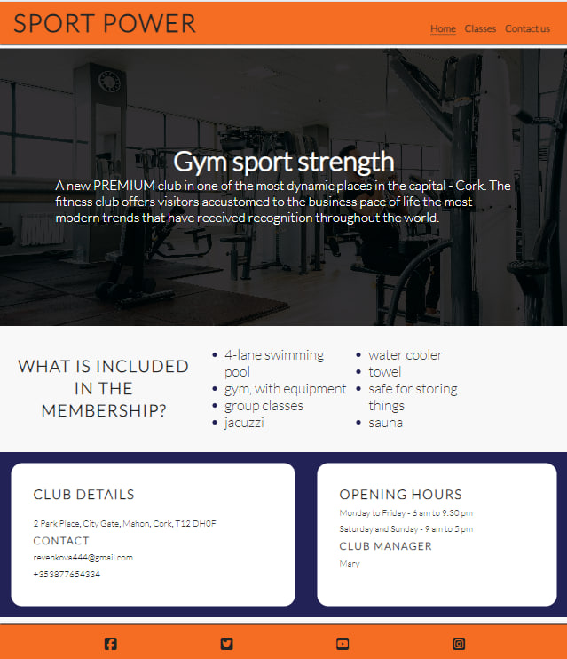

# Sport-Power

Sport Power is a website created for those who strive for top results in their training programs. Our aim is to inspire and motivate people on the path to a healthy lifestyle by providing personalized approaches to strength training, cardio, and dance, as well as offering a wide range of group classes led by experienced instructors.

## Features
+ ### Navigation Bar
  - At the top of the page, in the navigation bar in the left corner, the gym logo is displayed. On the right side, there are navigation links, namely:
     * "Home" - leads to the homepage, where users can learn about the gym.
     * "Classes" - leads to the page of classes and activities offered by the gym with a trainer.
     * "Contact Us" - leads to the contact form page, where users can fill out a form to get in touch with the company or leave feedback. 
   - Links have an animated effect when hovered.
   -navigation simply explains to the user the name of the gym and classes, making the information easy to find.

 

  + ### Home Page
     - The header displays the name of the gym with its location and a short motivational advertisement for people who want to improve their health and appearance
  
   