# TESTING

## Responsiveness

  #### The website was tested on the Chrome on the laptop screen:

  - Main Page:

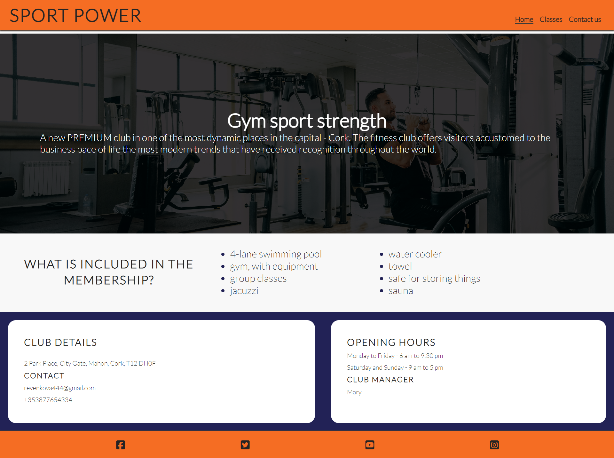

  - Classes & Lessons Page:

   - Contact Us page:

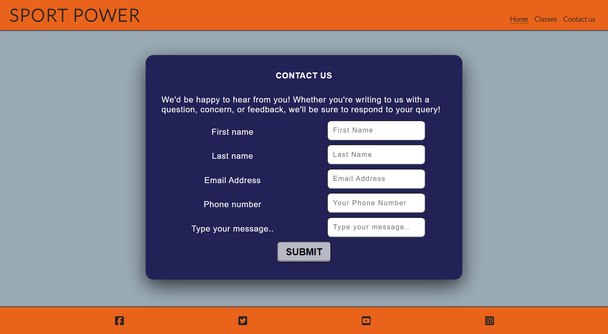

   - Response Page:

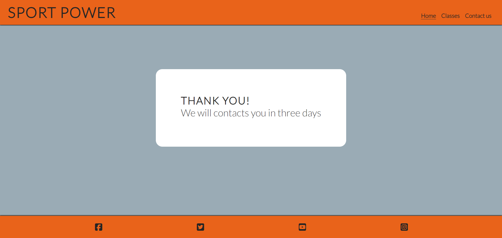

  #### The website was tested on the Chrome on the phone screen:
  - Main Page:

  - Classes & Lessons Page:

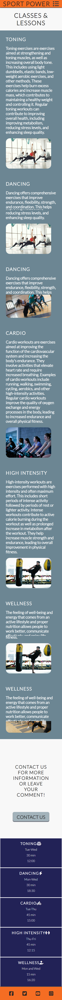

   - Contact Us page:

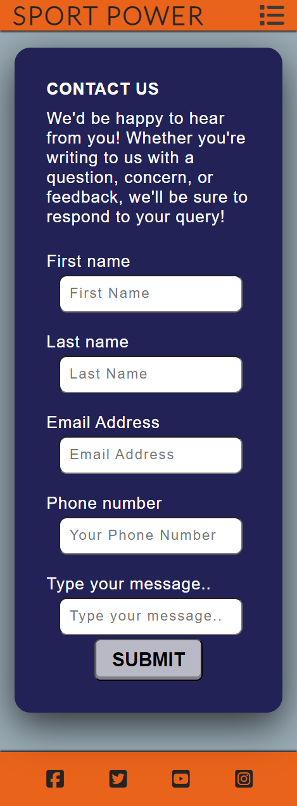

   - Response Page:

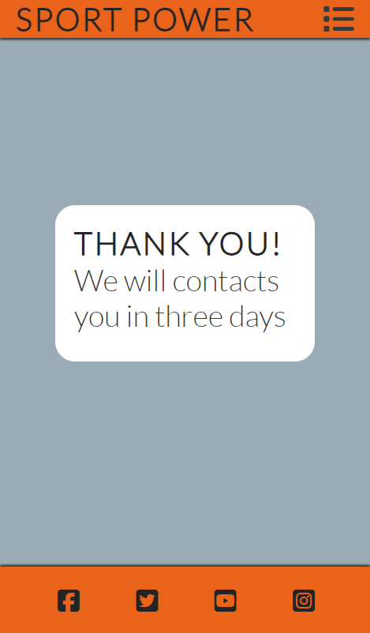

## Validator testing
+ ### HTML
  #### Home Page
    - No errors when passing through the W3C validator.

    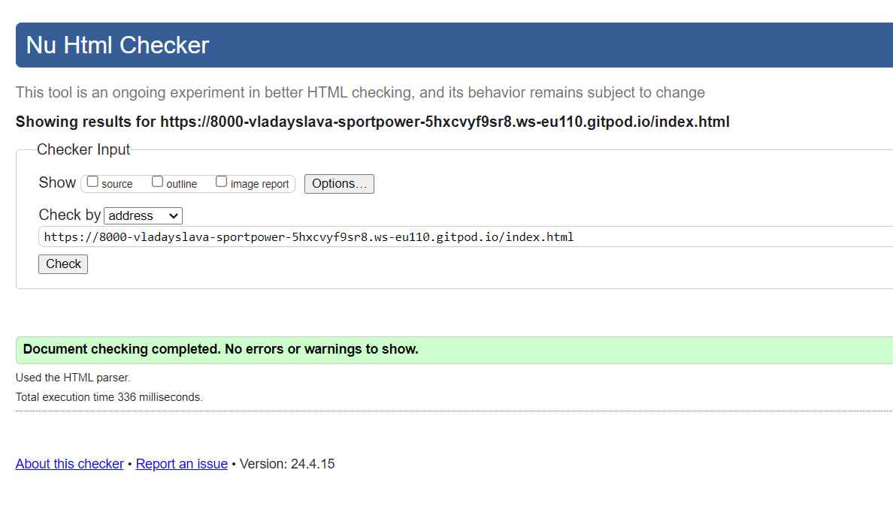

  #### CLASSES & LESSONS Page

   - No errors when passing through the W3C validator.

   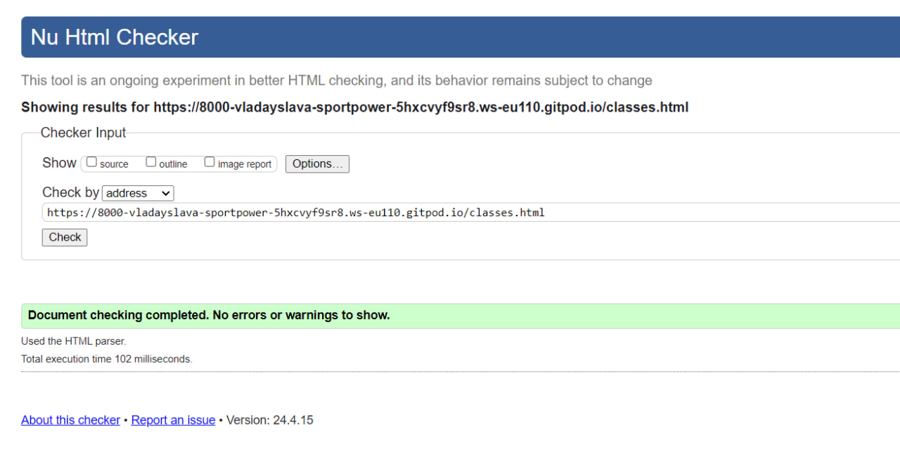

  #### Contact Us Page

   - No errors when passing through the W3C validator.

   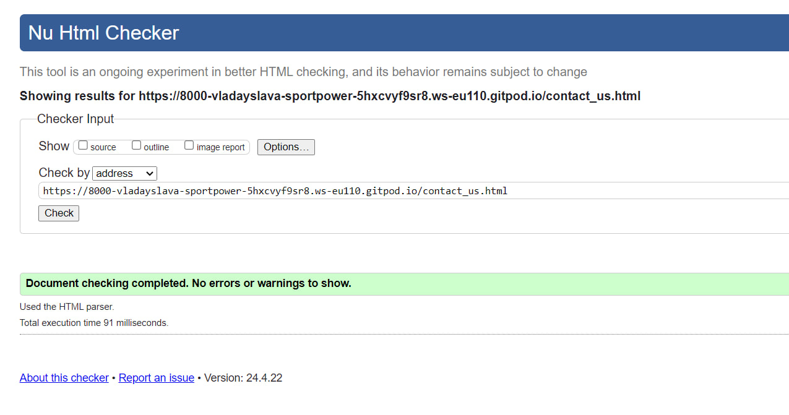
  
  #### Response Page

   - No errors when passing through the W3C validator.

   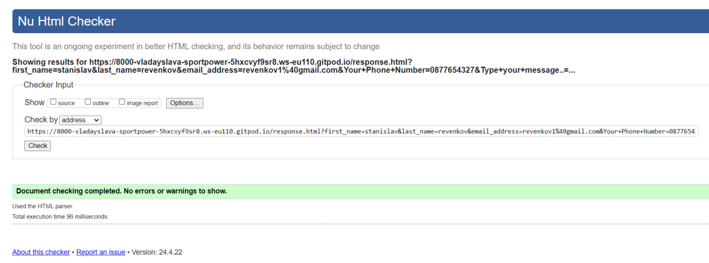

+ ### CSS

  #### Home Page
    - No errors when passing through the official W3C (Jigsaw) validator.

    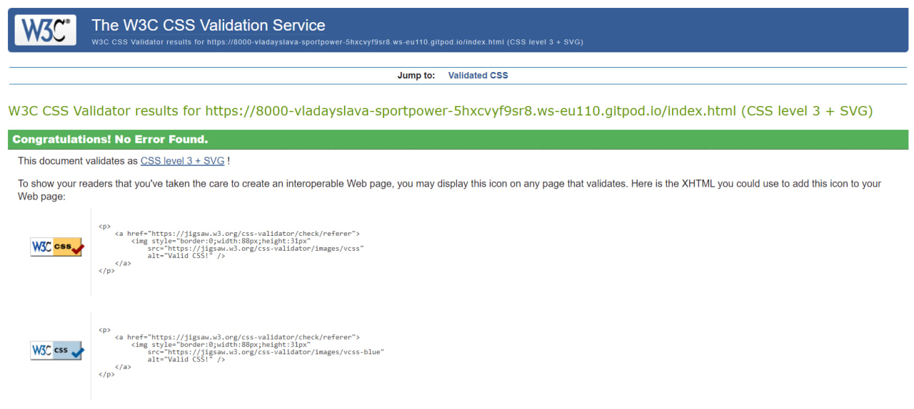

  #### CLASSES & LESSONS Page

   - No errors when passing through the official W3C (Jigsaw) validator.

   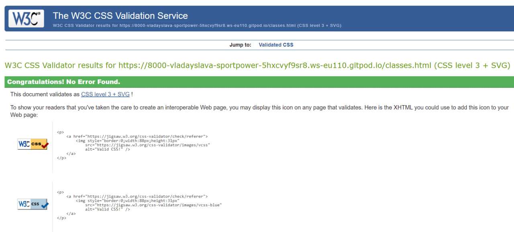

  #### Contact Us Page

   - No errors when passing through the official W3C (Jigsaw) validator.

   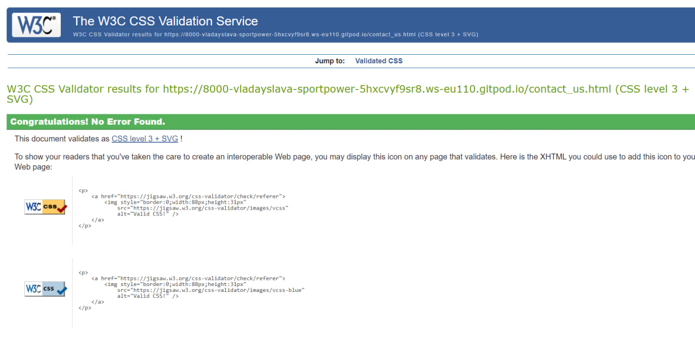
  
  #### Response Page

   - No errors when passing through the official W3C (Jigsaw) validator.

   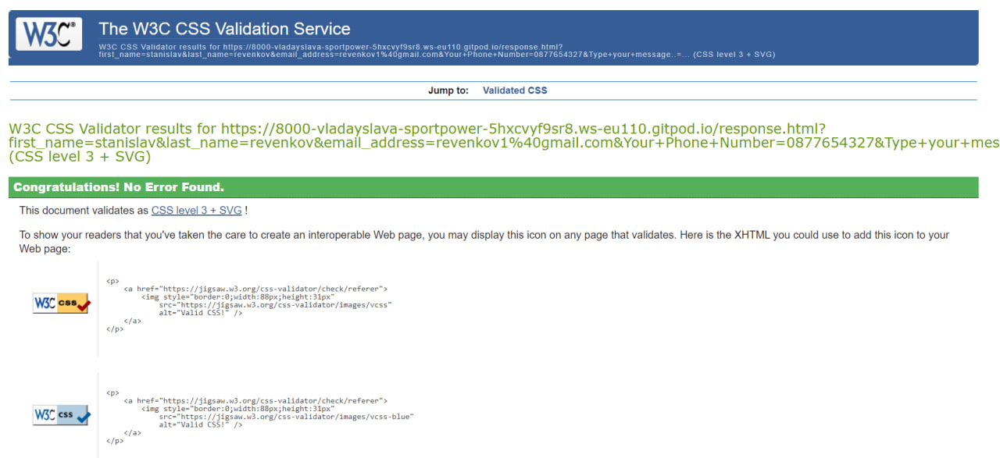

+ ## LightHouse report
  - Using the beacon in the developer tools, I showed that the website works correctly, the colors and fonts are readable

  ### Home page

  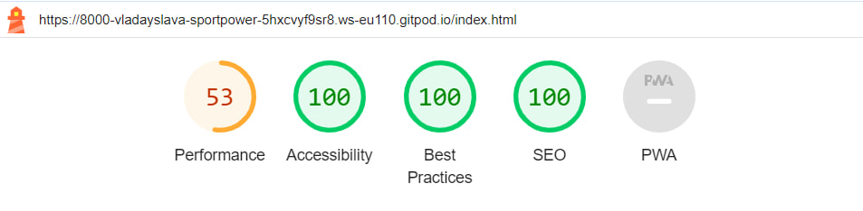

  ### CLASSES & LESSONS page

  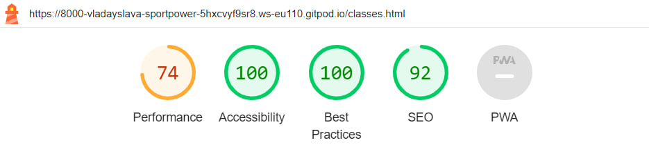

  ### Contact Us page

  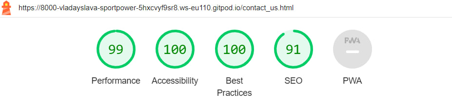

  ### Response page

  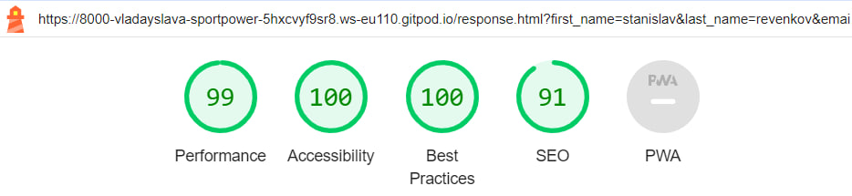

## Bugs
+ ### Solved bugs
  1. On the home page, the section with the information “What does membership include” was not placed correctly on mobile devices. All information was shifted to the left and the text was not visible.

    Solutions: use display: block, so that the element is displayed as a block element, which occupies the entire available width of the horizontal space and starts on a new line. This means that a line break will be created after the element, so that any subsequent elements will appear below it.

  2. No cursor when I hovered the mouse over the submit form button.

  Solutions: use cursor: pointer, so that the cursor looks like a pointer, indicating that the element is clickable and can be clicked.
  
+ ### Unsolved bugs
    - None.

